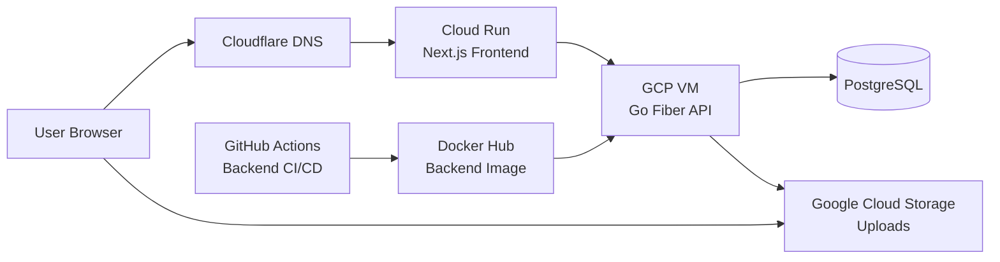

````md
# Devfolio API

Devfolio API is the backend service for a fullstack personal portfolio and blog platform.

This project was built to support a real portfolio/blog use case while also serving as a hands-on infrastructure and deployment practice project. It demonstrates how a backend API, database, cloud storage, CI/CD, and deployment workflow can work together in a production-like environment.

## Production Overview

- Frontend: `https://kraiwit.dev`
- Backend: deployed on a GCP Compute Engine VM
- Database: PostgreSQL running in Docker on the same VM
- Uploads: Google Cloud Storage
- Frontend deployment: Google Cloud Run
- DNS / Domain management: Cloudflare

## Stack

### Backend
- Go
- Fiber
- Clean Architecture
- GORM
- JWT auth

### Database
- PostgreSQL

### Infrastructure / DevOps
- Docker
- Docker Compose
- Google Compute Engine VM
- Google Cloud Storage
- GitHub Actions CI/CD
- Docker Hub
- Swagger

## What This API Supports

- Admin authentication
- Public profile data
- Featured projects
- Tags
- Published blog posts
- Admin post management
- Cover image upload
- Markdown content image upload
- Cloud Storage-based image hosting

## Architecture

```text
cmd/api
internal/
  config/
  database/
  router/
  delivery/http/
    handlers/
    middleware/
    response/
  domain/
    entities/
    repositories/
  usecase/
  infrastructure/persistence/
    gormmodel/
    repository/
pkg/
  auth/
  utils/
migrations/
````

## High-Level Deployment Architecture

* Frontend runs on **Google Cloud Run**
* Backend API runs on a **GCP Compute Engine VM**
* PostgreSQL runs in Docker on the same VM
* Uploaded images are stored in **Google Cloud Storage**
* DNS is managed through **Cloudflare**
* Frontend CI/CD deploys to Cloud Run
* Backend CI/CD deploys to the VM after CI succeeds

## Architecture Diagram



## Features

### Public Endpoints

* `GET /api/v1/health`
* `GET /api/v1/profile`
* `GET /api/v1/projects`
* `GET /api/v1/tags`
* `GET /api/v1/posts`
* `GET /api/v1/posts/:slug`

### Admin Endpoints

* `POST /api/v1/auth/login`
* `POST /api/v1/auth/logout`
* `POST /api/v1/admin/posts`
* `PUT /api/v1/admin/posts/:id`
* `DELETE /api/v1/admin/posts/:id`
* `GET /api/v1/admin/posts`
* `GET /api/v1/admin/posts/:id`
* `POST /api/v1/admin/tags`
* `PUT /api/v1/admin/profile`
* `POST /api/v1/admin/uploads/cover`

## Upload Handling

New uploads are stored in **Google Cloud Storage** and served over HTTPS.

This was introduced to:

* avoid mixed content issues
* reduce dependency on local VM disk for new uploads
* improve production-like file handling

Older local uploads may still exist, but new uploads are expected to use Cloud Storage.

## Local Development

### Run services

```bash
docker compose up -d
```

### Setup environment

```bash
cp .env.example .env
go mod tidy
```

### Run API

```bash
go run ./cmd/api
```

## Useful Commands

### Run locally

```bash
make up
```

### Run migration

```bash
make migrate-up
```

### Build

```bash
make docker-build
```

## Environment

Copy `.env.example` to `.env` and adjust values.

Important variables include:

* `APP_ENV`
* `APP_PORT`
* `DB_HOST`
* `DB_PORT`
* `DB_USER`
* `DB_PASSWORD`
* `DB_NAME`
* `JWT_SECRET`
* `ADMIN_EMAIL`
* `ADMIN_PASSWORD`
* `ADMIN_DISPLAY_NAME`
* `GCS_BUCKET_NAME`
* `GCS_PUBLIC_BASE_URL`

## Default Admin

Uses the values from `.env`:

* email: `ADMIN_EMAIL`
* password: `ADMIN_PASSWORD`

## API Documentation

Swagger is available in non-production environments.

Example route:

* `/swagger/*`

## Example Requests

### Login

```bash
curl -X POST http://localhost:8080/api/v1/auth/login \
  -H "Content-Type: application/json" \
  -d '{"email":"admin@example.com","password":"changeme123"}'
```

### Create post

```bash
curl -X POST http://localhost:8080/api/v1/admin/posts \
  -H "Authorization: Bearer <TOKEN>" \
  -H "Content-Type: application/json" \
  -d '{
    "title":"CI/CD Basics for Backend Developers",
    "summary":"A practical intro",
    "content":"# Hello\nThis is my first post.",
    "status":"published",
    "tags":["Go","CI/CD"]
  }'
```

## CI/CD

### CI

The backend CI workflow includes:

1. Start PostgreSQL service in GitHub Actions
2. Download dependencies
3. Run migrations
4. Generate Swagger docs
5. Run tests
6. Build the application
7. Build and push backend Docker image to Docker Hub

### CD

The backend CD workflow:

1. Waits for CI success on `main`
2. Connects to the VM through SSH
3. Pulls the latest code and image
4. Recreates containers with Docker Compose
5. Runs a post-deploy health check against `/api/v1/health`

This ensures deployment is not marked as successful until the API is actually ready.

## Operational Notes

* Backend currently runs on a VM to provide hands-on infrastructure experience
* PostgreSQL is colocated with the backend on the same VM
* Google Cloud Storage is used for uploaded files
* Backend deployment includes health verification after release
* Direct database access from external tools requires firewall/IP allowlisting

## Known Trade-Offs

* Backend is still deployed on a VM instead of Cloud Run
* PostgreSQL is still hosted inside the VM rather than as a managed database service
* Some older locally stored uploads may require manual cleanup or recreation
* Database access from tools like DBeaver depends on firewall source IP configuration

## Next Recommended Steps

1. Move backend from VM to Cloud Run
2. Move PostgreSQL to Cloud SQL
3. Add centralized monitoring and alerting
4. Improve rollback strategy for backend deployment
5. Improve secret management
6. Add more automated tests

## Why This Project Exists

This project was created as a practical backend and infrastructure learning project.

The goal was not only to build API features, but also to understand how:

* backend API design
* database hosting
* image uploads
* cloud object storage
* CI/CD
* deployment automation
* runtime health verification

fit together in a real environment.

```
```
